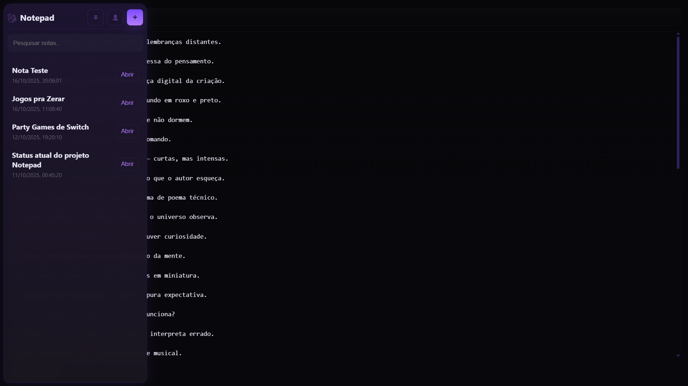
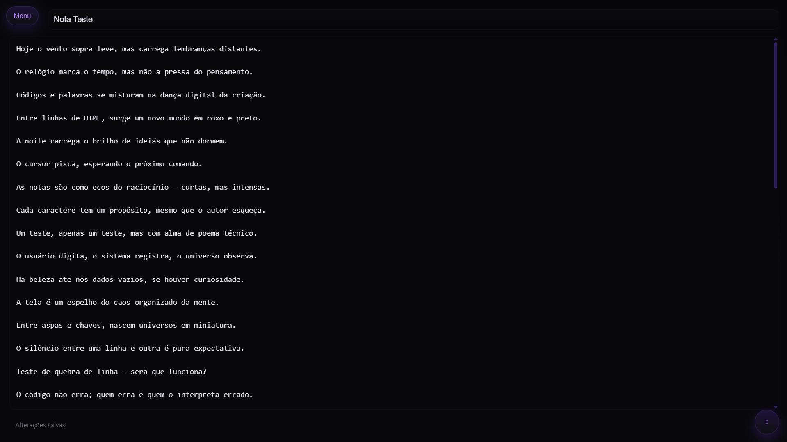

  

<h1 align="center">🌙 Notepad Online</h1>

  Um bloco de notas moderno, minimalista e online — envolto em tons de <strong>roxo escuro</strong> e <strong>preto</strong>, feito para quem escreve com estilo e foco.

  
  
  

---

## 🖤 Sobre o Projeto

O **Notepad Online** é um site projetado para ser seu espaço pessoal de escrita —  
leve, seguro e acessível de qualquer dispositivo.  
Com um design em **roxo escuro e preto**, ele oferece uma atmosfera imersiva e relaxante  
para quem quer escrever sem distrações, mas com um toque de elegância.

---

## ✨ Recursos Principais

- 💜 **Tema roxo escuro e preto** — ideal para quem ama interfaces elegantes e noturnas.  
- 🔑 **Login via e-mail ou conta Google** — acesso fácil e seguro.  
- 💾 **Salvamento online e sincronizado** — seus textos permanecem salvos automaticamente.  
- 🗃️ **Possibilidade de importar/exportar Notas** - salve suas notas localmente ou compartilhe-as.
- 📱 **Design responsivo** — adaptado para desktop, tablet e celular.  
- ⚡ **Interface minimalista** — sem menus confusos, apenas o essencial para escrever.  
- 🔒 **Foco na privacidade** — nenhum dado sensível é compartilhado.

---

## 🧩 Tecnologias Utilizadas

- 🟣 **HTML5** — estrutura e semântica do site  
- ⚫ **CSS3** — tema escuro, tipografia e animações sutis  
- 💜 **JavaScript (JS)** — lógica, interações e autenticação  
- 🗂️ **JSON** — armazenamento e manipulação de dados locais  

---

## 🚀 Acesse Agora

👉 **Site público:** [https://deivesss.github.io/Notepad/](https://deivesss.github.io/Notepad/)

Não é necessário instalação. Basta abrir o link acima e começar a escrever.  
Você pode entrar com **e-mail** ou **conta Google** para salvar suas anotações de forma segura.

---

## 📸 Preview

  
  

